# @discordts/builders

<div align="center">
  
  <p>Type-safe Discord Components builders for Bun</p>
</div>

`@discordts/builders` gives Bun developers a clean, zero-dependency way to build Discord Components payloads. No more hand-writing fragile JSON.

It covers modern layouts and modal inputs: containers, sections, text displays, media galleries, files, separators, labels, file uploads, radio groups, checkbox groups, select menus, and buttons.

The exported `ComponentType` enum includes Discord's current component values. Builders are provided for bot-usable components. 

> [!NOTE]
> **Disclaimer:** The logo design is inspired by discord.js.

## Why this package
- **Bun-first:** import the source directly in Bun. No build step is required.
- **Components coverage:** includes newer layout, content, and modal types from the official Discord specifications.
- **Runtime validation:** catches common Discord API limits before payloads are sent.
- **Type-level safety:** checks string lengths and structures using TypeScript template types.
- **Deserialization:** rebuild builders from existing raw component payloads.

## Installation
```bash
bun add @discordts/builders
```

Requirements:
- Bun >= 1.1.0
- TypeScript 5.x

We publish TypeScript source files directly instead of pre-transpiled files.

## Benchmarks

This package is optimized for speed. It runs close to 0ms overhead by using direct manual loops and avoiding heavy validation schemas. 



> [!TIP]
> **Performance Boost:** With over **6.6x performance** (more than 557% faster processing), `@discordts/builders` eliminates instantiation and serialization bottlenecks entirely, running close to 0ms overhead.

Below are the detailed results comparing **50,000 iterations** of component construction and serialization against `@discordjs/builders`.

*Last Benchmarked: June 18, 2026*

| Task | `@discordjs/builders` | `@discordts/builders` | Speed Comparison |
| :--- | :--- | :--- | :---: |
| **Instantiation** | ~158.0 ms | **~21.9 ms** | **7.2x faster** |
| **Serialization** | ~45.0 ms | **~9.0 ms** | **5.0x faster** |
| **Total** | ~203.0 ms | **~30.9 ms** | **6.6x faster** |

To run the benchmark yourself:
```bash
bun run benchmark:ci
```
> The SVG and README table are only regenerated automatically by CI on push. Running locally outputs results to the console only.

## Discord Components Flags
Discord V2 Components messages must be sent with the `IS_COMPONENTS_V2` message flag:
```ts
import { MessageFlags } from '@discordts/builders';

const flags = MessageFlags.IsComponentsV2;
```
When this flag is set, Discord treats components as the message body. Use `TextDisplayBuilder` and `ContainerBuilder` instead of relying on `content` or `embeds`.

## Quick Start
```ts
import {
  ActionRowBuilder,
  ButtonBuilder,
  ButtonStyle,
  ContainerBuilder,
  MessageFlags,
  SeparatorBuilder,
  SeparatorSpacingSize,
  TextDisplayBuilder,
} from '@discordts/builders';

const container = new ContainerBuilder()
    .addComponents(
      new TextDisplayBuilder({
        content: '# Release notes\nComponents V2, built with type-safe builders.',
      }),
      new SeparatorBuilder({
        divider: true,
        spacing: SeparatorSpacingSize.Small,
      }),
      new ActionRowBuilder({
        components: [
          new ButtonBuilder({
            customId: 'release:ack',
            style: ButtonStyle.Success,
            label: 'Acknowledge',
          }),
          new ButtonBuilder({
            style: ButtonStyle.Link,
            url: 'https://discord.com/developers/docs/components/reference',
            label: 'Discord docs',
          }),
        ],
      }),
    );

const payload = {
  flags: MessageFlags.IsComponentsV2,
  components: [container],
};
```

## Smart Layout
`SmartLayoutBuilder` automatically packs buttons into valid rows (up to 5 per row) and keeps select menus on dedicated rows.
```ts
import {
  ButtonBuilder,
  ButtonStyle,
  SmartLayoutBuilder,
  StringSelectMenuBuilder,
} from '@discordts/builders';

const rows = new SmartLayoutBuilder()
  .addButtons(
    new ButtonBuilder({ customId: 'page:prev', style: ButtonStyle.Secondary, label: 'Previous' }),
    new ButtonBuilder({ customId: 'page:next', style: ButtonStyle.Primary, label: 'Next' }),
  )
  .addSelectMenu(
    new StringSelectMenuBuilder({
      customId: 'page:section',
      placeholder: 'Jump to section',
      options: [
        { label: 'Overview', value: 'overview' },
        { label: 'Details', value: 'details' },
      ],
    }),
  )
  .build();

const components = rows;
```

## Modals
Modals can contain labels wrapping inputs, text inputs, and other components. ActionRow builders can also be passed directly to accommodate legacy layouts.
```ts
import {
  LabelBuilder,
  ModalBuilder,
  RadioGroupBuilder,
  RadioGroupOptionBuilder,
  TextInputBuilder,
  TextInputStyle,
} from '@discordts/builders';

const modal = new ModalBuilder({
  customId: 'feedback:modal',
  title: 'Send Feedback',
  components: [
    new LabelBuilder({
      label: 'What should improve?',
      component: new TextInputBuilder({
        customId: 'feedback:message',
        style: TextInputStyle.Paragraph,
        minLength: 10,
        maxLength: 1000,
        required: true,
      }),
    }),
    new LabelBuilder({
      label: 'Priority',
      component: new RadioGroupBuilder({
        customId: 'feedback:priority',
        required: true,
        options: [
          new RadioGroupOptionBuilder({ value: 'low', label: 'Low' }),
          new RadioGroupOptionBuilder({ value: 'normal', label: 'Normal', default: true }),
        ],
      }),
    }),
  ],
});
```

## Validation & Auditing
Use `toJSON()` if you want violations to throw instantly. Use `BaseComponent.auditTree()` if you prefer non-blocking diagnostics.
```ts
import { BaseComponent } from '@discordts/builders';

const warnings = BaseComponent.auditTree(payload);
for (const warning of warnings) {
  console.warn(warning);
}
```
The auditor checks component limits, duplicate custom IDs, missing fields, and character length overflows.

## Development
Check the type definitions and run tests locally:
```bash
bun install
bun test
bun run typecheck
```
See [CONTRIBUTING.md](./CONTRIBUTING.md) for more details.

---

*Note: The tests, JSDocs, and code comments in this repository were generated by an AI and subsequently reviewed and reworked by a human.*
