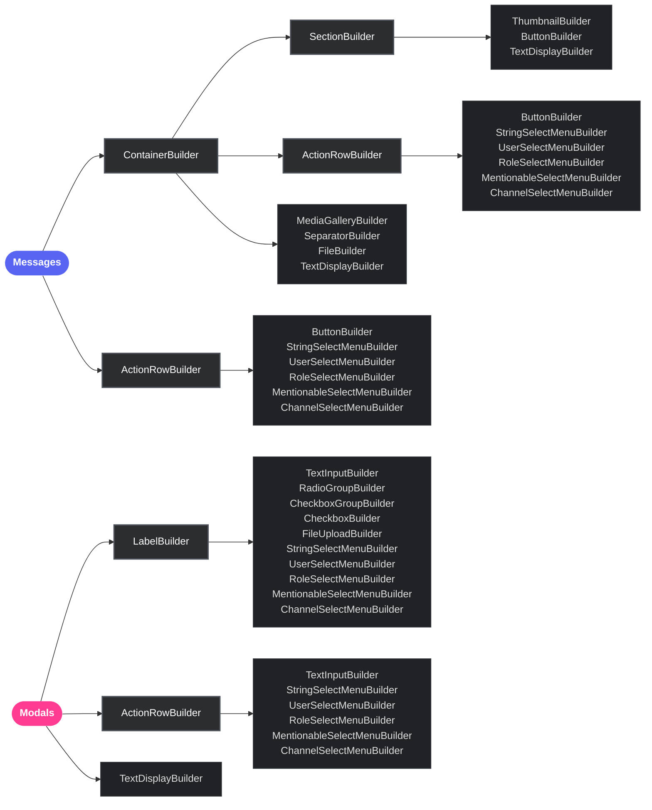

<div align="center">
  

  <h3>Type-safe Discord Components builders for Bun</h3>

  <p>
    <a href="https://npmjs.com/package/@buncord/builders"></a>
    <a href="https://bun.sh"></a>
    <a href="https://www.typescriptlang.org"></a>
    <a href="LICENSE"></a>
  </p>

  <p>
    
    
    
  </p>
</div>

---

## Why is your bot wasting CPU cycles on heavy validation?

Traditional Discord component builders process and transpile complex validation logic *at runtime* on every single serialization. This creates noticeable bottlenecks in high-scale bots.

`@buncord/builders` solves this by shifting safety checks to the **type level (compile-time)**. You get a frictionless, zero-dependency, ultra-lightweight library designed natively for Bun that serializes components **and is way faster**.

---

## Key Benefits for Developers

- **Zero Dependency Footprint:** Standard lockfiles shouldn't require dozens of transitives just to build a payload. We ship with **zero dependencies**.
- **Compile-Time Safety:** Invalid component structures, overflow lengths, and mismatched options fail *while you type*, not in production.
- **Drop-in Migration:** Easily swap `@discordjs/builders` imports out and enjoy near-zero overhead without rewriting your logic.
- **Next-Gen Component Support:** Only support for Discord's latest component.

---

## Get Started in 30 Seconds

### Install
```bash
bun add @buncord/builders
```
*Requirements: Bun ≥ 1.1.0 and TypeScript 5.x*

## Benchmarks

This package is optimized for speed. It runs close to 0ms overhead by using direct manual loops and avoiding heavy validation schemas. 


> [!TIP]
> **Performance Boost:** With over **7.6x performance** (more than 664% faster processing), `@discordts/builders` eliminates instantiation and serialization bottlenecks entirely, running close to 0ms overhead.

Below are the detailed results comparing **50,000 iterations** of component construction and serialization against `@discordjs/builders`.

*Last Benchmarked: June 19, 2026*

| Task | `@discordjs/builders` | `@buncord/builders` | Speed Comparison |
| :--- | :--- | :--- | :---: |
| **Instantiation** | ~138.6 ms | **~13.8 ms** | **10.1x faster** |
| **Serialization** | ~38.5 ms | **~9.4 ms** | **4.1x faster** |
| **Total** | ~177.1 ms | **~23.2 ms** | **7.6x faster** |

## Component Architecture



Components V2 messages must be sent with the `IS_COMPONENTS_V2` message flag:

```ts
import { MessageFlags } from '@buncord/builders';
const flags = MessageFlags.IsComponentsV2;
```

When this flag is set, Discord treats components as the message body. Use `TextDisplayBuilder` and `ContainerBuilder` instead of relying on `content` or `embeds`.

## Component Coverage

| Type | ID | Available in |
|:-----|:--:|:------------|
| ActionRow | 1 | Messages · Modals |
| Button | 2 | Messages · Section accessory |
| StringSelect | 3 | Messages · Modals |
| TextInput | 4 | Modals |
| UserSelect | 5 | Messages · Modals |
| RoleSelect | 6 | Messages · Modals |
| MentionableSelect | 7 | Messages · Modals |
| ChannelSelect | 8 | Messages · Modals |
| Section | 9 | Messages |
| TextDisplay | 10 | Messages · Modals |
| Thumbnail | 11 | Messages |
| MediaGallery | 12 | Messages |
| File | 13 | Messages |
| Separator | 14 | Messages |
| Container | 17 | Messages |
| Label | 18 | Modals |
| FileUpload | 19 | Modals |
| RadioGroup | 21 | Modals |
| CheckboxGroup | 22 | Modals |
| Checkbox | 23 | Modals |

## Examples & Demos

All runnable examples live in [`/exemples`](./exemples):

| Example | Description |
|:--------|:------------|
| [`quick-start.ts`](./exemples/quick-start.ts) | Full Components V2 message payload |
| [`smart-layout.ts`](./exemples/smart-layout.ts) | Auto-packing buttons and select menus into rows |
| [`modals.ts`](./exemples/modals.ts) | Modal with text inputs, radio groups, checkboxes, and file upload |
| [`validation.ts`](./exemples/validation.ts) | Runtime validation and `auditTree()` diagnostics |
| [`webhook.ts`](./exemples/webhook.ts) | Sending a payload to a Discord webhook |

## Validation & Auditing

Use `toJSON()` for eager throwing on violations. Use `BaseComponent.auditTree()` for non-blocking diagnostics with structured codes, paths, and fix suggestions. See [`exemples/validation.ts`](./exemples/validation.ts).

```ts
import { BaseComponent } from '@buncord/builders';
const warnings = BaseComponent.auditTree(payload);

const issues = BaseComponent.auditTree(payload, { structured: true });
for (const issue of issues) {
  console.warn(`[${issue.code}] ${issue.message} → ${issue.fix}`);
}
```

The auditor checks: component limits, duplicate `customId`s, missing required fields, character length overflows, and mixed ActionRow contents.

## Development

```bash
bun install          # install dependencies
bun test             # run tests
bun test --coverage  # run tests with coverage
bun run typecheck    # run TypeScript type checks
```

See [CONTRIBUTING.md](./CONTRIBUTING.md) for more details.

---

*Note: The tests, JSDocs, and code comments in this repository were generated by an AI and subsequently reviewed and reworked by a human.*
